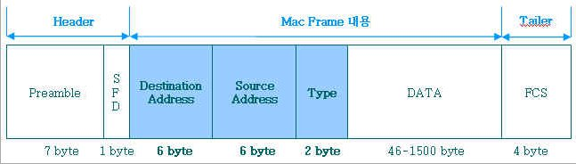

# 네트워크

## 1. 네트워크와 네트워킹

### 네트워크
> 네트워크 케이블이나 전화선, 무선 링크 등으로 연결되어 동일한 프로토콜을 사용하는 `디바이스`들의 집합

    
### 네트워킹
> 네트워크에 연결된 디바이스들 간의 데이터 전송

## 2. 네트워크 통신 방법
* 주소  
  - 디바이스들은 각자의 고유 주소를 사용해서 서로의 위치를 파악하고 통신한다.
  
* 데이터 전송
  + 패킷 사용
    - 헤더: 송신자와 수신자의 주소와 체크섬(checksum), 기타 유용한 정보들을 포함한다.
    - 바디: 전송할 데이터를 바이트 그룹으로 포함한다.
    
  

## 3. OSI 7계층(Open Systems Interconnection 7 Layer)
> OSI 7 계층은 네트워크에서 통신이 일어나는 과정을 7단계로 나눈 것으로, 1970년대 말 IOS(International Oraganization for Standardization)에 의해 만들어 졌다.

---|:---:|---:
`계층`|명칭|역할| 
`1`|`물리 계층(Physical Layer)`|데이터 링크 계층에서 형성된 데이터 패킷을 전기 신호나 광 신호로 바꾸어 송수신하는 역할을 담당한다.
   

2. 데이터 링크 계층(Data Link Layer)

3. 네트워크 계층(Network Layer)

4. 트랜스포트 계층(Transport Layer)

5. 세션 계층(Session Layer)

6. 프리젠테이션 계층(Presentation Layer)

7. 애플리케이션 계층(Application Layer)

## 참고자료
* http://www.blakeleyllp.com/industries.php?area=ElectronicTechnologyCommunications
* http://blog.naver.com/PostView.nhn?blogId=shj1126zzang&logNo=220053175349&parentCategoryNo=&categoryNo=&viewDate=&isShowPopularPosts=false&from=postView
* https://karfn84.tistory.com/entry/network-%ED%8C%A8%ED%82%B7-%EA%B5%AC%EC%A1%B0-ether-tcp-ip-header
* https://shlee0882.tistory.com/110
