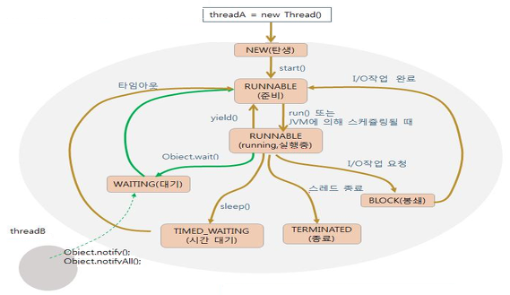
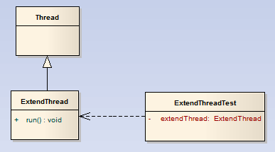
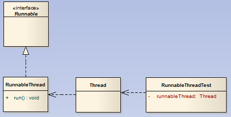
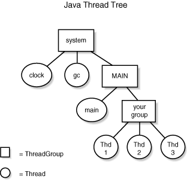

# 스레드(Thread)

## 1. 스레드란
> 운영체제에서 실행되는 하나의 프로그램을 프로세스라고 볼 때 스레드란 그 프로세스 안에서 실행되는 하나의 실행흐름이다.

* 프로세스
     * 자기 자신만의 주소 공간을 갖는 독립적인(Self-Contained) 실행 프로그램

* 스레드
    * 프로세스 내의 독립적인 순차흐름 또는 제어
    * 경량 프로세스(Light-weight Process)
    * 스레드는 병렬로 작업을 처리할 수 있어서 서버 프로그램 등 대부분의 경우, 애플리케이션의 성능과 효율을 향상 시켜준다.
    * 이미지 프로세싱처럼 CPU 사용률이 높고 오랜 시간이 걸리는 작업은 멀티스레드를 사용하면 오히려 성능이 저하된다.


```text
    자바는 언어적 차원에서 스레드를 지원하는 가장 일반적인 언어 중 하나인데, C/C++와 달리 자바 키워드로 동기화를 지원해준다.
    이렇게 자바 언어가 스레드를 강력하게 지원하게 된 이유 중 하나는 자바가 실행되는 기반인 JVM 자체가 하나의 프로세스기 때문이다.
```

## 2. 스레드의 생성과 시작




#### white-box
디자인 패턴에서 상속을 통한 재사용을 `white-box-reuse`라고 한다.



#### black-box
디자인 패턴에서 합성을 통한 재사용을 `black-box-reuse`라고 한다.



#### 상속 vs 합성
GoF의 디자인 패턴에서는 "Favor object compositon over class inheritance"라고 말한다. 이를 해석하면 "객체 합성이 클래스 상속보다 더 나은 방법이다." 라는 내용이다.
  
  * 상속
    어떤 객체를 상속하면 private으로 선언되지 않은 모든 변수와 메소드, 생성자가 하위클래스에 노출이 되기 때문에 하위클래스에서 수퍼클래스의 내부가 보인다는 의미로 디자인 패턴에서는 상속을 통한 재사용을 `white-box reuse`라고 말한다.
    
      * 장점
        - 오버라이딩을 통해 수퍼클래스의 구현을 손쉽게 재정의할 수 있다.
        
      * 단점
        - 수퍼클래스가 하위클래스에 불필요하게 많은 부분이 노출된다는 것이다.(캡슐화에 위배되고 하위클래스가 수퍼클래스의 구현에 종속된다.)
        - 컴파일 시점에 객체의 형식이 이미 결정된다는 것이다.(유연성이 떨어진다.)
        - 시스템이 진화할수록 상속 관계가 복잡해져서 수정과 확장에 손쓰지 못하는 상황이 발생할 가능성이 생긴다.
        
  * 합성
    객체가 다른 객체의 참조자를 얻는 방식으로 런타임 시에 동적으로 이루어지며, 참조 객체의 내부를 볼 수 없기 때문에 디자인 패턴에서는 `black-box-reuse`라고 말한다.
    
      * 장점
        - 객체의 인터페이스만을 바라보게 됨으로써 캡슐화가 잘 이루어진다. 
        
      * 단점
        - 객체 간의 관계가 수직관계가 아닌 수평 관계이기 때문에 큰 시스템에서 많은 부분에 걸쳐 합성이 사용될 때 객체나 메소드 명이 명확하지 않으면 코드의 가독성이 떨어지고 이해하기 어려워진다.
        
```text
    객체의 캡슐화를 유지할 수 있기 때문에 시스템 설계자들이 상속보다 합성을 더 선호한다.
```


## 3. 스레드의 종료
stop()이라는 메소드가 있었지만 여러 문제점으로 인해 썬 마이크로시스템즈(Sun Microsystems)에서 이 메소드를 사용하지 말 것을 권고하고 있다. 현재는 크게 두가지 방식으로 구현할 수 있다.

#### flag를 이용하는 방법  
```java
    class StopThread implements Runnable {        
        // 조건문을 빠져나가기 위해 사용할 플래그 변수다.
        private boolean stopped = false;
        public void run() {
            // stopped 프래그를 while문 조건으로 사용한다.
            while (!stopped) {
                System.out.println("Thread is alive.");
                try {
                    
                    Thread.sleep(500);
                } catch (InterruptedException e) {
                    e.printStackTrace();
                }
            }
            System.out.println("Thread is dead..");
        }
        // 이 메소드 호출로 StopThread가 멈춘다.
        public void stop() {
            stopped = true;
        }
    }
    
    public class StopThreadTest {
        public static void main(String[] args){
            StopThreadTest stt = new StopThreadTest();
            stt.process();
        }
        
        public void process() {
            // StopThread 인스턴스를 생성한 후 이 인자를 파라미터로 받는 스레드 인스턴스를 생성하여 시작한다.
            StopThread st = new StopThread();
            Thread thread = new Thread( st );
            thread.start();
            try {
                Thread.sleep(1000);
            } catch (InterruptedException e) {
                e.printStackTrace();
            }
            // StopTread를 정지시킨다.
            st.stop();
        }
    }
```
첫 번째 방법에는 몇 가지 문제점이 있는데, 
만약 스레드가 run() 메소드 안의 트정 로직에서 무한 루프를 돌거나 조건 루프를 도는 시간이 너무 오래 걸리는 작업을 한다면 
stopped 플래그를 검사할 수 없다는 것이다. 
이럴 경우는 stopped 플래그를 자주 검사할 수 있도록 중간중간에 체크문을 적절히 삽입해야 한다.

#### interrupt를 이용하는 방법
```java
    class AdvanceStopTread implements Runnable {
        @Override
        public void run() {
            try {
                // isInterrupted() 메소드를 while문 조건으로 사용한다.
                while (!Thread.currentThread().isInterrupted()) {
                    System.out.println("Thread is alive..");
                    Thread.sleep(500);
                } 
            } catch (InterruptedException e) {
                // 예상했던 예외이므로 무시한다.
            } finally {
                // 마무리 해야 할 작업이 있는 경우 이곳에서 정리한다.
                System.out.println("Thread is dead..");
            }
        }
    }
    
    public class AdvanceStopThreadTest {
        public static void main(String[] args){
            AdvanceStopThreadTest astt = new AdvanceStopThreadTest();
            astt.process();
        }
        
        public void process() {
            // AdvancedStopThread 인스턴스를 생성한 후 이 인자를 파라미터로 받는 스레드 인스턴스를 생성한 후 시작한다.
            AdvanceStopTread ast = new AdvanceStopTread();
            Thread thread = new Thread(ast);
            thread.start();
            try {
                Thread.sleep(1000);
            } catch (InterruptedException e) {
                e.printStackTrace();
            }
            // AdvancedStopThread를 정지시킨다.
            thread.isInterrupted();
        }
    }
```
두 번째 방법은 interrupt() 메소드를 사용하는 것이다. 
`interrupt()` 메소드는 현재 수행하고 있는 명령을 바로 중지시키며, 
호출하는 시점에 `Object` 클래스의 wait() 메소드나 `Thread` 클래스의 join(), sleep 메소드가 호출된 경우에는 
`InterruptedException`을 발생시킨다.

## 4. 데몬스레드와 join()
자바에서는 애플리케이션 내부의 모든 스레드가 종료되지 않으면 JVM이 종료되지 않는다. `NomalThreadTest.java` 참고하기 바란다.

#### 데몬스레드
  > "애플리케이션 내부의 모든 스레드가 종료되지 않으면 `JVM`이 종료되지 않는다"는 조건에서 예외가 되는 것으로 `DeamonThreadTest.java`를 참고하기 바란다. 
    주의할 점은 스레드를 시작시키기 전에 setDeamon() 메소드로 데몬스레드를 설정해 주어야한다. 
    만약 스레드를 시작시킨 후에 setDeamon() 메소드를 호출하면 `IllegalStateException`이 발생한다.
  
#### join()
  > main 스레드가 생성해서 실행시킨 스레드가 종료될 때까지 기다려야 하는 상황을 위해 Thread 클래스에는 join() 메소드를 제공하고 있다. `ThreadJoinTest.java`를 참고하기 바란다.
  
## 5. 스레드 그룹
> 자바에서 모든 스레드는 특정 스레드 그룹에 멤버로서 존재하게 된다. 
  이때 최상위 스레드 그룹은 MAIN 스레드 그룹인데, 이렇게 만들어진 main 스레드 그룹 인스턴스는 main 스레드를 생성해서 애플리케이션 실행 포인트인 main() 메소드를 호출하는 것이다.
  이후 생성되는 스레드와 스레드 그룹은 기본적으로 main 스레드 그룹에 포함된다. 또한 하나의 스레드 그룹은 하위 스레드 그룹과 스레드들을 멤버로 가질 수 있다.



## 6. 스레드 우선순위
스레드 여러 개를 운영하는 애플리케이션이라면 때때로 특정 스레드가 먼저 실행하게 하고 싶은 경우가 있을 것이다.
`JVM`은 실행 대기중에 있는 스레드 중에서 우선 순위가 높은 스레드에게 먼저 작업할 권한을 주게 되는데, 
만약 우선순위가 같은 스레드가 있다면 JVM 구현 방식에 따라 시분할(Time Sharing 또는 타임 슬라이싱) 방식으로 스레드에게 작업 기회를 주게 된다.
Thread 클래스에서는 이런 상황에서 개발자가 스레드를 적절히 제어할 수 있도록 스레드의 우선순위를 설저알 수 있는 메소드를 제공한다.

    하이퍼스레딩이 지원되지 않는 CPU라면 멀티 CPU 머신이 아닌 이상 한 순간에 스레드 하나 밖에 실행할 수 없다.

* 객체(Object)
    - `Object`를 상속한 어떤 `Class` 자체를 의미한다.
    
* 인스턴스(Instance)
    - 인스턴스화는 객체가 만들어지는 것, 즉 메모리에 로드되는 것을 말하고 이렇게 만들어져 힙에 저장된 객체를 `Instance`라고 한다.

        
스레드 우선순위도 가급적 사용하지 말 것을 권장한다.
그 이유는 시스템과 스레드 자체에 대한 높은 수준의 지식 없이 스레드를 건드리면 예상치 못한 버그가 발생할 가능성이 높기 때문이다.
또한 굳이 스레드의 우선순위를 런타임 시점에 바꿔가며 사용할 만한 상황도 별로 없다.
     
## 7. 멀티스레드와 동기화

## 8. 생성자-소비자 패턴

## 참고자료
* https://12bme.tistory.com/65
* http://blog.naver.com/PostView.nhn?blogId=ovter&logNo=161128618
* https://sjh836.tistory.com/121
* http://www.webbasedprogramming.com/Java-Unleashed-Second-Edition/ch9.htm