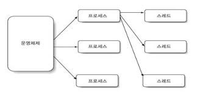
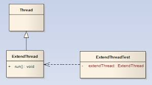

# 스레드(Thread)

## 스레드란
프로세스
 * 자기 자신만의 주소 공간을 갖는 독립적인(Self-Contained) 실행 프로그램

스레드
 * 프로세스 내의 독립적인 순차흐름 또는 제어
 * 경량 프로세스(Light-weight Process)
 * 스레드는 병렬로 작업을 처리할 수 있어서 서버 프로그램 등 대부분의 경우, 애플리케이션의 성능과 효율을 향상 시켜준다.
 ※ 이미지 프로세싱처럼 CPU 사용률이 높고 오랜 시간이 걸리는 작업은 멀티스레드를 사용하면 오히려 성능이 저하된다.  



## 스레드의 생성과 시작


1. white-box



2. black-box


3. 상속 vs 합성
  > `GoF의 디자인 패턴`에서는 `Favor object compositon over class inheritance`라고 말한다. 이를 해석하면 `객체 합성이 클래스 상속보다 더 나은 방법이다`
  
  * 상속
    > 어떤 객체를 상속하면 private으로 선언되지 않은 모든 변수와 메소드, 생성자가 하위클래스에 노출이 되기 때문에 하위클래스에서 수퍼클래스의 내부가 보인다는 의미로     > 어떤 객체를 상속하면 private으로 선언되지 않은 모든 변수와 메소드, 생성자가 하위클래스에 노출이 되기 때문에 하위클래스에서 수퍼클래스의 내부가 보인다는 의미로 디자인 패턴에서는 상속을 통한 재사용을 `white-box reuse`라고 말한다.
    
      * 장점
        - 오버라이딩을 통해 수퍼클래스의 구현을 손쉽게 재정의할 수 있다.
        
      * 단점
        - 수퍼클래스가 하위클래스에 불필요하게 많은 부분이 노출된다는 것이다.(캡슐화에 위배되고 하위클래스가 수퍼클래스의 구현에 종속된다.)
        - 컴파일 시점에 객체의 형식이 이미 결정된다는 것이다.(유연성이 떨어진다.)
        - 시스템이 진화할수록 상속 관계가 복잡해져서 수정과 확장에 손쓰지 못하는 상황이 발생할 가능성이 생긴다.
        
  * 합성
    > 객체가 다른 객체의 참조자를 얻는 방식으로 런타임 시에 동적으로 이루어지며, 참조 객체의 내부를 볼 수 없기 때문에 디자인 패턴에서는 `black-box-reuse`라고 말한다.
    
      * 장점
        - 객체의 인터페이스만을 바라보게 됨으로써 캡슐화가 잘 이루어진다. 
        
      * 단점
        - 객체 간의 관계가 수직관계가 아닌 수평 관계이기 때문에 큰 시스템에서 많은 부분에 걸쳐 합성이 사용될 때 객체나 메소드 명이 명확하지 않으면 코드의 가독성이 떨어지고 이해하기 어려워진다.
        
```
    객체의 캡슐화를 유지할 수 있기 때문에 시스템 설계자들이 상속보다 합성을 더 선호한다.
```

## 스레드의 종료

## 데몬스레드와 join()

## 스레드 우선순위

## 멀티스레드와 동기화

## 생성자-소비자 패턴

## 참고자료
* 
* http://blog.naver.com/PostView.nhn?blogId=ovter&logNo=161128618